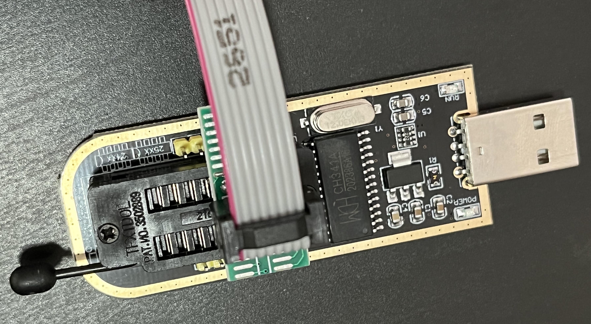

# T480-OpenCore-Mod-Hackintosh


[](https://github.com/acidanthera/OpenCorePkg)
[](https://www.apple.com/macos/monterey/)
[](https://www.microsoft.com/en-us/windows)

## Introduction

<details>
<summary><strong>Hardware</strong></summary>
<br>


[](https://pcsupport.lenovo.com/us/en/products/laptops-and-netbooks/thinkpad-t-series-laptops/thinkpad-t480-type-20l5-20l6/downloads/ds502355)

| Category  | Component                         | Note                                                         |
| --------- | --------------------------------- | ------------------------------------------------------------ |
| CPU       | Intel Core i5-8350U               |                                                              |
| GPU       | Intel UHD 620                     |                                                              |
| SSD0      | Crucial BX500 1000GB SATA         | NVMeFix.kext removed, you can use NVMe SSD to replace it     |
| SSD1      | NE-512 512GB NVMe                 | Windows 10                                                   |
| Memory    | 8+8GB DDR4 2400Mhz                |                                                              |
| Battery   | Dual battery                      |                                                              |
| Camera    | 720p Camera                       |                                                              |
| Wifi & BT | FenVi BCM94352Z                   | Driver Not Needed                                            |
| Input     | PS2 Keyboard & Synaptics TrackPad | [YogaSMC](https://github.com/zhen-zen/YogaSMC) for media keys like microphone switch, etc. PrtSc is mapped as F13. |

</details>  

<details>

<summary><strong>Main software</strong></summary>
<br>

| Component      | Version       | Note                                                                    |
| -------------- | ------------- |-------------------------------------------------------------------------|
| macOS Monterey | 12.3.1(21E258)|[gibMacOS](https://github.com/corpnewt/gibMacOS)                         |
| Windows 10     | 21H1          |[windows10](https://www.microsoft.com/en-us/software-download/windows10) |
| OpenCore-Mod   | v0.7.9        |Mod OpenCore to boot windows with not applying acpi patching             |

</details>

<details>

<summary><strong>Kernel extensions</strong></summary>
<br>

| Kext                  | Version        | Note                                                         |
| :-------------------- | -------------- | -------------------------------------------------------------|
| ~~AirportBrcmFixup~~  | ~~2.1.4~~      | FenVi BCM94352Z, Not Needed                                  |
| ~~AppleALC~~          | ~~1.7.0~~      | FenVi BCM94352Z, Not Needed                                  |
| AppleALC              | 1.7.0          | Sound                                                        |
| BrightnessKeys        | 1.0.2          |                                                              |
| CPUFriend             | 1.2.4          |                                                              |
| CPUFriendDataProvider | i5-8350U       |                                                              |
| HibernationFixup      | 1.4.5          |                                                              |
| IntelMausi            | 1.0.8          | Intel Network Interface                                      |
| Lilu                  | 1.6.0          |                                                              |
| NoTouchID             | 1.0.4          | disable fingerprint                                          |
| ~~NVMeFix~~           | ~~1.1.0~~      | If I add it, opencore boot stuck occasionally                |
| RTCMemoryFixup        | 1.0.8          |                                                              |
| VirtualSMC            | 1.2.9          |                                                              |
| VoltageShift          | Disabled, 1.22 |                                                              |
| VoodooPS2Controller   | 2.2.8          |                                                              |
| VoodooRMI             | 1.3.4          |                                                              |
| VoodooSMBus           | 3.0.0          |                                                              |
| WhateverGreen         | 1.5.8          |                                                              |
| YogaSMC               | 1.5.1          |                                                              |

</details>

<details>

<summary><strong>UEFI drivers</strong></summary>
<br>

|     Driver      | Version           |
| :-------------: | ----------------- |
|  AudioDxe.efi   | OpenCorePkg 0.7.9 |
|   HfsPlus.efi   | OcBinaryData      |
| OpenCanopy.efi  | OpenCorePkg 0.7.9 |
| OpenRuntime.efi | OpenCorePkg 0.7.9 |

</details>

## Before installation

<details>  

<summary><strong>UEFI settings</strong></summary>
<br>

**Security**

- `Security Chip` **Disabled**
- `Memory Protection -> Execution Prevention` **Enabled**
- `Virtualization -> Intel Virtualization Technology` **Enabled**
- `Virtualization -> Intel VT-d Feature` **Enabled**
- `Anti-Theft -> Computrace -> Current Setting` **Disabled**
- `Secure Boot -> Secure Boot` **Disabled**
- `Intel SGX -> Intel SGX Control` **Disabled**
- `Device Guard` **Disabled**

**Startup**

- `UEFI/Legacy Boot` **UEFI Only**
- `CSM Support` **No**

**Thunderbolt**

- `Thunderbolt BIOS Assist Mode` **Disabled**
- `Wake by Thunderbolt(TM) 3` **Disabled**
- `Security Level` **User Authorization**
- `Support in Pre Boot Environment -> Thunderbolt(TM) device` **Enabled**

</details>  

<details>

<summary><strong>Own prev-lang-kbd</strong></summary>
<br>

Either add as a string or as a data ( HEX data [(ProperTree)](https://github.com/corpnewt/ProperTree) )

Format is lang-COUNTRY:keyboard

- 🇨🇳 | [252] en - ABC --> zh-Hans:252 --> 7A682D48 616E733A 323532
- 🇺🇸 | [0] en_US - U.S --> en-US:0 --> 656e2d55 533a30

etc.

[AppleKeyboardLayouts.txt](https://github.com/acidanthera/OpenCorePkg/blob/master/Utilities/AppleKeyboardLayouts/AppleKeyboardLayouts.txt)

</details>

## Status

<details>  


<summary><strong>What's working ✅</strong></summary>

- [x] Battery percentage, **Sometimes cycles count not correct**
- [x] Bluetooth - FenVi BCM94352Z
- [x] Boot chime, **Message: "HDA: Open PCI I/O protocol (try disconnectHda quirk?) - Already started" Twice at booting**
- [x] Boot menu `OpenCanopy` 
- [x] CPU power management / performance `Now on par with Windows without XTU undervolt.`
- [x] FireVault 2 `No config.plist changes needed` 
- [x] GPU UHD 620 hardware acceleration / performance, H264 and HEVC supported.
- [x] HDMI `Closed and opened lid. With audio.`
- [x] iMessage, FaceTime, App Store, iTunes Store. **Generate your own SMBIOS**
- [x] Intel I219V Ethernet port
- [x] Keyboard `Volume and brightness hotkeys. Another media keys with YogaSMC.`
- [x] Microphone `With keyboard switch using ThinkPad Assistant.`
- [x] Realtek® ALC3287 ("ALC257") Audio
- [x] SD card reader `Fortunately, USB connected.`
- [x] Sidecar wired `Works with 15,2 SMBIOS.`**but I'm not test it**
- [x] Sleep/Wake 
- [x] TouchPad `1-5 fingers swipe works. Emulate force touch using longer and more voluminous touch.`
- [x] TrackPoint  `Works perfectly. Just like on Windows or Linux.`
- [x] USB Ports `USB Map is different for devices with Windows Hello camera.`
- [x] Web camera
- [x] Wifi - FenVi BCM94352Z
- [x] DRM `Widevine, validated on Firefox 82. WhateverGreen's DRM is broken on Big Sur`
- [x] Windows 10 boot from moded OC boot menu, same as using `F12` boot from `Windows Boot Manager`

</details>  

<details>  

<summary><strong>What's not working ⚠️</strong></summary>

- [ ] Fingerprint reader  `There is finally after many years working driver for Linux (python-validity), don't expect macOS driver any time soon.`

- [ ] PM 981 `Still unstable.`

- [ ] Sidecar wireless `If you want to use this feature, buy a compatible Broadcom card!`

</details>  

<details>  

<summary><strong>Need help</strong></summary>

- [ ] Thunderbolt to DP  `Can't recognize 4k display, but is normal under windows booting via OC.`

</details>  

## Post Install

<details>

<summary><strong>GenSMBIOS</strong></summary>

We use script [GenSMBIOS](https://github.com/corpnewt/GenSMBIOS) to create fake serial number, UUID and MLB numbers. **This step is essential to have working iMessage, so do not skip it!**

The process is the following:

- Download GenSMBIOS as a ZIP, then extract it.
- Start GenSMBIOS.bat and use option 1 to download MacSerial.
- Choose option 2, to select the path of the config.plist file. It will be located in EFI -> OC folder.
- Choose option 3, and enter ```MacBookPro15,2``` as the machine type.
- Press Q to quit. Your config now should contain the requied serials.

</details>  

<details>

<summary><strong>Enter the proper ROM value</strong></summary>

Using Plist editor [ProperTree](https://github.com/corpnewt/ProperTree) to add serials and the computer's MAC address to the config.plist file. **This step is also essential to have a working iMessage, so do not skip it**. You have to change the MAC address value in the config.plist at

```PlatformInfo -> Generic -> ROM```

Delete the generic ```112233445566``` value, and enter your MAC address into the field, without any colons. Save the Plist file, and it is now ready to be written out to the EFI partition of your media.

</details>


## UEFI modding

<details>

<summary><strong>CFG Lock | Advanced menu</strong></summary>

It's possible to unlock Advanced menu thus disable CFG Lock natively in UEFI + Other Advanced menu benefits. SPI Programmer CH341a is required, and following [Unlock BIOS Advanced Menu](https://github.com/digmorepaka/thinkpad-firmware-patches) to flash BIOS.

|     Figure                                                                         | Note                     |
| :--------------------------------------------------------------------------------: | ------------------------ |
|         | SPI CH341A Programmer    |
|| BIOS CHIP On MotherBoard |
|  | Model of BIOS CHIP        |


</details>

##  Credits

https://github.com/hexart/T480-OpenCore-Hackintosh

https://github.com/EETagent/T480-OpenCore-Hackintosh

https://github.com/zexry619/Thinkpad-T480-Hackintosh-Dualboot
